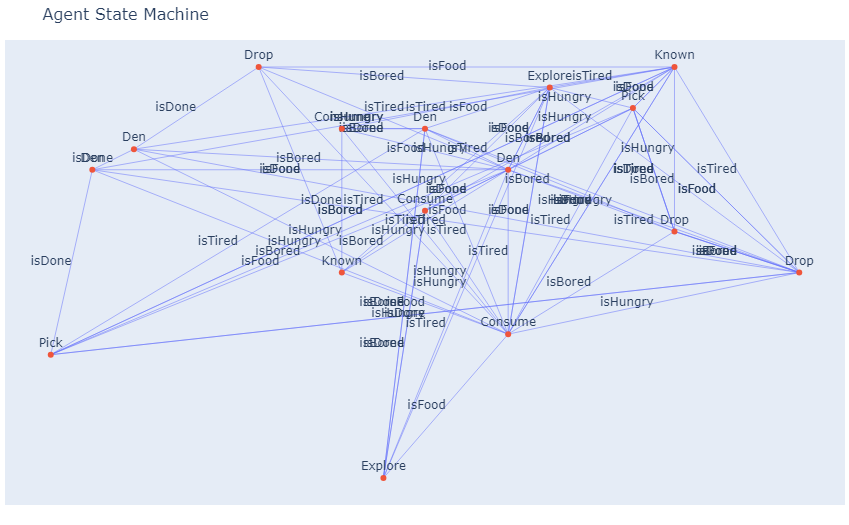

## NOTES

This is a live repo

### Current work
- O-time problem on some runs
- Building testing apparatus for data collection
- ideas fixes for occasional dead populations

# Real Time Grammatical Evolution FSM Agent Swarm

Swarm Algorithms is a field of study that mimics the intelligent behavior of natural swarms found in nature. Similar to their counterparts in nature, the collective intelligence emerges from the interactions and behaviors of individual, non-intelligent components.

Rather than explicitly coding or programming the behavior of each non-intelligent component, the behavior is derived using a grammatical evolution algorithm. This approach enables the swarm to optimize its actions relative to its available commands and environment. For the remainder of the summary, the individual components of the swarm will be referred to as agents.

The project is simulated through Pygame and uses python's mulithreading. Each agent's game loop is run on an individual thread until end condtions are met. The end condition is determined by the number of actions. 

- **Dependencies**
    - Numpy
    - Pygame
    - Plotly

This summary will go over the anatomy of the agent and the grammatical evolution proccess. 

## Agent

Each agent is composed of a finite state machine (FSM), where each state represents either an explicitly defined action or a behavior determined by a behavior tree. The behavior tree itself is generated through grammatical evolution.

Note: Each agent stores two FSM and Behavior trees. One is the tested FSM and Tree. The other is the testing FSM and Behavior Tree. 

### FSM

The agent builds a FSM based on a given `phenotype` string which was generated by the grammatical evolution. The `phenotype` is composed of different states. It assigns transitions between states based on available inputs.

- **Commands and Corresponding States**:
  - `"Pick"` → `Pick`
  - `"Drop"` → `Drop`
  - `"Consume"` → `Consume`
  - `"Explore"` → `Explore`
  - `"Den"` → `Den`
  - `"Known"` → `Known`

- **Transition Types**:
  - `"isDone"`
  - `"isFood"`
  - `"isTired"`
  - `"isBored"`
  - `"isHungry"`

The phenotype contains an order of commands for which a state is create for each corispoindg command. Each new state is added to a `fillqueue` and the transition type `isDone` is set between itself and the next state. The last state in the phenotype sets its `isDone` transition to the first state, creating a loop. After which, iterate through the `fillqueue` to connect created states with remainding transition types. Each state connects to an existing state that the command list determines by iteration. The chosen state is the lasted created state of that state type. No two transition types for a state leads to the same state. This is done by decrementing through the list of available states of that type. 

### Explore Tree

For the explore state, the agent builds a behavior tree from a `phenotype` string. The tree is composed of nodes that represent specific commands, and these nodes are connected hierarchically based on the `phenotype`. 

- **Tree Node Types**:
  - `left`
  - `forward`
  - `right`
  - `isBored`
  - `func2`
  - `ifFood`
  - `isFood`

## Grammatical Evolution

This project's grammatical evolution (GE) is modeled after the GEESE.
https://faculty.cs.byu.edu/~mike/mikeg/papers/NeupaneGoodrichMercer-GECCO2018.pdf

### Phenotype Production

A phenotype is the output of the Grammatical Evolution (GE) process. In typical GE implementations, each agent possesses a genotype, which is a list of numerical values. Each number corresponds to either a terminal or non-terminal in the provided grammar. The genotype is parsed into a list of terminals using this grammar, forming the phenotype.

What sets this project apart is its use of a weighted graph to fully express each genotype. The weighted graph encapsulates the structure of the grammar and is designed to return the nearest terminal for a given input. This approach ensures that every genotype is completely expressed, providing a robust mechanism for converting genetic information into actionable behaviors or commands.

### Conditions for Evolution 

The agent runs the evolution command once two conditions are met. First, the rate of food gathered at the Den is not positive. Second, if the agents tested gene score is lower than a percentage of the averge score of the local population. 

A special condition to note is if an agent's collected food over the past interval is zero and if the agent is at the den. This special condition ensures that an agent becomes productive.

### Process of Evolution

Before the evolution process begins the tested gene gets defined a score using the food deposited and the total food gathered in the time interval. Such that if the testing gene has a better score, it replaces the existing tested gene. If the conditions are met, the agent creates a new gene through crossover of the nearby agents. This new gene is stored in the testing genes and is tested in the next interval. 

### Crossover

From the nearby agents, parents are selected based on a novelty threshold of their tested gene score. Novelty is deterimned by a threshold of the average score of the nearby agents. Once novel parents are selected, crossover randomly selects one of the parents and transfers from the parent genotype a list of numbers until it reaches a terminal number. This continues until a new genotype is formed form the  information of the parents. If there are no novel parents then the genotype of the agent will be mutated by randomly changing integers in the genotype of the evolving agent. 